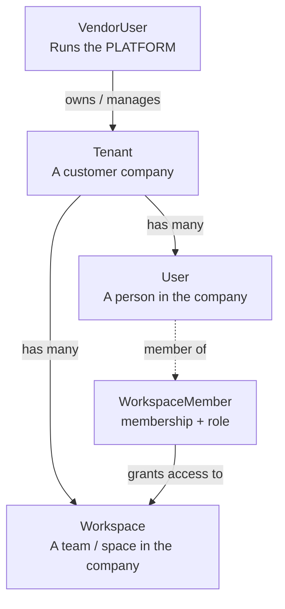

# EnterpriseAI — Three-Tier Authentication Model

A clear, example-driven explanation of the **Vendor → Tenant → Workspace**
3-tier authentication model and the database tables that implement it.

## 1. The Hierarchy (top → bottom)



```
VendorUser  ──  who operates the PLATFORM (EnterpriseAI itself)
   │  owns
   ▼
Tenant      ──  who BUYS / uses the platform (a customer company)
   │  has many workspaces  +  has many users
   ▼
Workspace   ──  a team/space INSIDE that company
   ▲
   │  membership with role
WorkspaceMember  ── connects User ↔ Workspace
```

---

## 2. Tier 1 — `VendorUser` (Platform Admin)

A person who runs the **platform itself** — an employee of the company that
sells EnterpriseAI (the vendor). They create and manage **tenants**.

| Column           | Meaning                                      |
| :--------------- | :------------------------------------------- |
| `id`             | Unique platform user id                      |
| `email`          | Login email (unique)                         |
| `hashed_password`| Argon2id password hash                       |
| `full_name`      | Display name                                 |
| `is_active`      | Can they log in?                             |
| `is_superuser`   | Top-level admin flag                         |

### Example rows

| id | email                  | full_name    | is_active | is_superuser |
| :- | :--------------------- | :----------- | :-------- | :----------- |
| `v-1001` | priya@enterpriseai.io | Priya Sharma | `true`  | `true`  |
| `v-1002` | rahul@enterpriseai.io | Rahul Verma  | `true`  | `false` |

---

## 3. Tier 2 — `Tenant`

A **customer organization** on the platform. Everything else (users,
workspaces) hangs off a tenant. Tenants do not log in — they are containers.

| Column          | Meaning                              |
| :-------------- | :----------------------------------- |
| `id`            | Unique tenant id                     |
| `name`          | Company name                         |
| `slug`          | URL-friendly name (unique)           |
| `status`        | `active` / `suspended` / ...         |
| `vendor_user_id`| Which platform admin manages it      |

### Example rows

| id | name       | slug       | status   | vendor_user_id |
| :- | :--------- | :--------- | :------- | :------------- |
| `t-2001` | Acme Corp | acme-corp | `active` | `v-1001` |
| `t-2002` | Globex    | globex    | `active` | `v-1002` |

> Related table `SsoConfig` — per-tenant OIDC settings (client id/secret,
> discovery URL). Example: Acme's Google Workspace SSO config.

---

## 4. Tier 2½ — `User` (Tenant User)

A **person inside a tenant**. Holds credentials for local login
(`hashed_password`) OR SSO linkage (`oidc_sub`, `auth_provider`).

| Column             | Meaning                                      |
| :----------------- | :------------------------------------------- |
| `id`               | Unique user id                               |
| `tenant_id`        | The tenant this person belongs to (one only) |
| `email`            | Login email (unique)                         |
| `hashed_password`  | Argon2id hash; `NULL` for SSO-only users     |
| `full_name`        | Display name                                 |
| `is_active`        | Can they log in?                             |
| `auth_provider`    | `local` or `sso`                             |
| `oidc_sub`         | Provider subject id (links an SSO identity)  |

### Example rows

| id | tenant_id | email            | hashed_password | full_name  | auth_provider | oidc_sub |
| :- | :-------- | :--------------- | :-------------- | :--------- | :------------ | :------- |
| `u-3001` | `t-2001` | bob@acme.com   | `$argon2id$...` | Bob Kumar  | `local`       | `NULL`   |
| `u-3002` | `t-2001` | alice@acme.com | `NULL`          | Alice Lee  | `sso`         | `1052349...google.com` |

---

## 5. Tier 3 — `Workspace` and `WorkspaceMember`

### 5.1 `Workspace`

A **team / space / project inside a tenant** — the scope a user actually works in.

| Column     | Meaning                                  |
| :--------- | :--------------------------------------- |
| `id`       | Unique workspace id                      |
| `tenant_id`| The tenant this workspace belongs to     |
| `name`     | e.g. "Engineering"                       |
| `slug`     | URL-friendly name (unique per tenant)    |
| `status`   | `active` / `archived` / ...              |

### Example rows

| id | tenant_id | name        | slug        | status   |
| :- | :-------- | :---------- | :---------- | :------- |
| `w-4001` | `t-2001` | Engineering | engineering | `active` |
| `w-4002` | `t-2001` | Marketing   | marketing   | `active` |
| `w-4003` | `t-2002` | Sales       | sales       | `active` |

### 5.2 `WorkspaceMember`

The **membership record** connecting users ↔ workspaces (a many-to-many join
table with an extra `role` column).

| Column        | Meaning                                  |
| :------------ | :--------------------------------------- |
| `id`          | Unique membership id                     |
| `workspace_id`| Which workspace                          |
| `user_id`     | Which user                               |
| `role`        | `owner` / `admin` / `member` / `viewer`  |

### Example rows

| id | workspace_id | user_id | role    |
| :- | :----------- | :------ | :------ |
| `wm-5001` | `w-4001` | `u-3001` | `admin` |
| `wm-5002` | `w-4001` | `u-3002` | `member`|
| `wm-5003` | `w-4002` | `u-3002` | `owner` |

> Notice: `u-3002` (Alice) is a member of **two** workspaces with different
> roles — exactly why the membership lives in its own table.

---

## 6. End-to-End Worked Example

**Scenario:** *Bob logs into Acme Corp and works in the Engineering workspace.*

1. EnterpriseAI platform admin Priya (`v-1001`) creates tenant **Acme Corp**
   (`t-2001`).
2. Bob registers → a `User` row (`u-3001`, tenant `t-2001`) is created.
3. A default workspace **Engineering** (`w-4001`) is auto-provisioned, and a
   `WorkspaceMember` row links Bob as `admin`.
4. Bob logs in → the service issues a JWT.

```sql
-- Which workspaces does Bob belong to, and with what role?
SELECT u.email, w.name AS workspace, wm.role
FROM users u
JOIN workspace_members wm ON wm.user_id = u.id
JOIN workspaces w        ON w.id = wm.workspace_id
WHERE u.tenant_id = 't-2001'
ORDER BY u.email;
```

| email          | workspace   | role    |
| :------------- | :---------- | :------ |
| alice@acme.com | Engineering | member  |
| alice@acme.com | Marketing   | owner   |
| bob@acme.com   | Engineering | admin   |

---

## 7. How It Maps to the JWT

Every token carries the three tiers:

```json
{
  "sub":  "u-3001",            // User
  "tid":  "t-2001",            // Tenant
  "wid":  "w-4001",            // Workspace
  "role": "admin",             // from WorkspaceMember (or owner on register)
  "type": "access",
  "iss":  "enterprise-ai-auth",
  "aud":  "enterprise-ai",
  "exp":  1787754317
}
```

- `sub` → **which User** is calling
- `tid` → **which Tenant (company)** → enables per-tenant **Row-Level Security**
  (`src/db/rls.py` sets `app.current_tenant` so Postgres policies scope rows)
- `wid` → **which Workspace** they are working in
- `role` → what they may do there

Any microservice can verify this token against `/.well-known/jwks.json` and
enforce tenant/workspace scoping without a DB lookup.

---

## 8. Side-by-Side Comparison

| | `VendorUser` | `Tenant` | `User` | `Workspace` | `WorkspaceMember` |
| :--- | :--- | :--- | :--- | :--- | :--- |
| **What is it?** | Person who runs the platform | A customer company | A person in that company | A team/space in the company | Membership of a user in a workspace |
| **Level** | Tier 1 (Vendor) | Tier 2 (Tenant) | Tier 3 (Tenant User) | Tier 3 (Workspace) | Link table (many-to-many) |
| **Example row** | `priya@enterpriseai.io` | `Acme Corp` | `bob@acme.com` | `Acme / Engineering` | `bob → Engineering, role=admin` |
| **Owns / belongs to** | owns many Tenants | belongs to a VendorUser; has many Workspaces + Users | belongs to one Tenant | belongs to one Tenant | connects one User to one Workspace |
| **Auth role** | platform superuser | container (no login) | logs in (local or SSO) | scope of work (`wid` in JWT) | grants `role` in the JWT |
| **Unique per** | email | slug | email / oidc_sub | tenant_id + slug | workspace_id + user_id |
