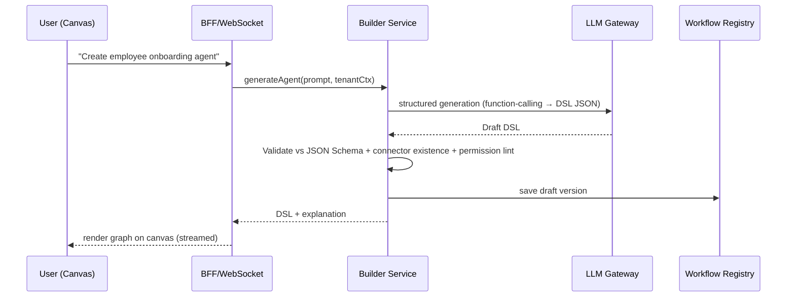
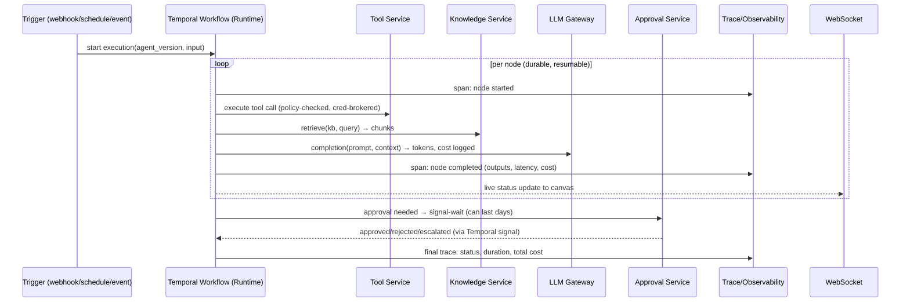

# Enterprise AI Agent Platform — System Design & Tech Stack

> **Based on:** `PRODUCT_VISION_AGENTS.pdf` (Product North Star, 31 pages)
> **Status:** Proposed Architecture v1.0
> **Audience:** Engineering, AI/ML

---

## Table of Contents

1. [Product Summary](#1-product-summary)
2. [Requirements Analysis](#2-requirements-analysis)
3. [High-Level Architecture](#3-high-level-architecture)
4. [Service Decomposition](#4-service-decomposition)
5. [Core Domain Model](#5-core-domain-model)
6. [Agent Definition Format (Workflow DSL)](#6-agent-definition-format-workflow-dsl)
7. [Execution Flow](#7-execution-flow)
8. [Key Subsystem Designs](#8-key-subsystem-designs)
9. [Tech Stack](#9-tech-stack)
10. [Multi-Tenancy & Security](#10-multi-tenancy--security)
11. [Observability & Trust](#11-observability--trust)
12. [Deployment Architecture](#12-deployment-architecture)
13. [Phased Roadmap (Aligned to Golden Path)](#13-phased-roadmap)
14. [Key Architectural Decisions (ADRs)](#14-key-architectural-decisions-adrs)

---

## 1. Product Summary

The platform lets an enterprise go from **"I have a business problem"** to **"a production-ready AI agent solving it"** without needing LLM, RAG, or orchestration expertise.

**Five pillars (from the vision doc):**

| Pillar | Capability |
|---|---|
| **Create** | NL-to-agent generation, visual builder, templates |
| **Intelligence** | Reasoning, tool selection, memory, structured output, multi-agent |
| **Connect** | CRM/ERP/HRIS/Slack/Teams/DBs/Internal APIs/MCP servers |
| **Knowledge** | Enterprise knowledge bases (RAG): policies, handbooks, docs |
| **Operate** | Deploy, monitor, debug, evaluate, version, rollback, audit, scale |

**Non-negotiables from the doc:**
- Multi-tenant SaaS with hard tenant isolation (agents, knowledge, credentials, executions, logs).
- Every execution has a **complete trace** ("What did the agent do?") — trust is a feature.
- Human-in-the-loop approvals with approver, role, timeout, escalation, rejection path, audit trail.
- Governance permissions at: User → Workspace → Agent → Knowledge → Tool → Action.
- Marketplace agents = Agent + Workflow + Tools + Knowledge + Guardrails + Evaluation + Config.
- **"We should not build a demo that requires a complete rewrite to become production."** — the architecture below is designed production-first.

---

## 2. Requirements Analysis

### Functional

- **FR-1 Natural-language agent creation:** user prompt → structured workflow draft (AI Designer).
- **FR-2 Conversational editing:** "add manager approval before creating record" → graph diff/patch.
- **FR-3 Visual builder:** drag-drop canvas; live execution status on nodes ("alive canvas").
- **FR-4 Templates:** prebuilt Finance/HR/Sales/Support/IT agents.
- **FR-5 Node types:** Trigger (webhook/schedule/event/manual), AI Agent step, Knowledge retrieval, Condition/router, Tool call, Human Approval, Notification, Transform, Loop/Subflow.
- **FR-6 Integrations:** connectors + generic HTTP + **MCP servers**; OAuth credential vault per tenant.
- **FR-7 Knowledge Bases:** upload docs → chunk → embed → retrieve; reusable across agents; tenant-scoped.
- **FR-8 Memory:** conversation/session memory + long-term entity memory per agent.
- **FR-9 Test & Evaluate:** manual runs, test datasets, eval suites, execution traces.
- **FR-10 Versioning & deployment:** draft → version → staging → production, rollback.
- **FR-11 Human approvals:** pause execution, notify approver (email/Teams/Slack/inbox), timeout → escalate/reject.
- **FR-12 Monitoring:** runs, success/failure, latency, token cost, per-node drill-down.
- **FR-13 Marketplace:** publish/install capability packages.
- **FR-14 Governance:** RBAC, per-agent tool/action permissions, policy engine, immutable audit log.

### Non-Functional (production quality bar)

| Attribute | Target |
|---|---|
| Multi-tenancy | Row-level + storage-prefix isolation; no cross-tenant leakage ever |
| Availability | ≥ 99.9% control plane; runtime decoupled so builder downtime ≠ agent downtime |
| Scalability | Horizontal; long-running executions are durable and resumable (days, not seconds) |
| Traceability | 100% of executions traced end-to-end (inputs, prompts, retrievals, tool calls, cost) |
| Auditability | Append-only audit log of every state change and approval |
| Security | Secrets in vault (never in workflow JSON), least-privilege tool scopes, encryption at rest/in transit |
| Latency UX | Streaming node-status updates to canvas over WebSocket/SSE |
| Model flexibility | Provider-agnostic (OpenAI/Anthropic/Azure/self-hosted); swappable via gateway |

---

## 3. High-Level Architecture

**Style:** Modular services behind an API gateway — a pragmatic middle ground between a monolith and full microservices. Start with deployable modules, split under load.

```
                            ┌──────────────────────────────────────────────┐
                            │                 CLIENTS                      │
                            │   Web App (Builder Canvas) · Public API/SDK  │
                            └───────────────────┬──────────────────────────┘
                                                │ HTTPS / WSS
                                     ┌──────────▼──────────┐
                                     │    API GATEWAY      │  authN, rate limit,
                                     │  (Kong / Traefik)   │  tenant resolution
                                     └──────────┬──────────┘
        ┌───────────────┬───────────────┬──────┴───────┬────────────────┐
        ▼               ▼               ▼              ▼                ▼
┌──────────────┐ ┌─────────────┐ ┌────────────┐ ┌─────────────┐ ┌─────────────┐
│ Identity &   │ │ Agent       │ │ Agent      │ │ Knowledge   │ │ Integration │
│ Access (IAM) │ │ Builder     │ │ Runtime    │ │ Service     │ │ /Tool       │
│              │ │ Service     │ │ (Temporal) │ │ (RAG)       │ │ Service     │
│ OIDC, RBAC,  │ │ NL→DSL,     │ │ durable    │ │ ingest,     │ │ connectors, │
│ policies     │ │ validation, │ │ workflow   │ │ chunk,      │ │ MCP,        │
│              │ │ versions    │ │ execution  │ │ embed, query│ │ credentials │
└──────┬───────┘ └──────┬──────┘ └─────┬──────┘ └──────┬──────┘ └──────┬──────┘
       │                │              │               │               │
       │         ┌──────▼──────────────▼───────────────▼───────────────▼──────┐
       │         │                    PLATFORM CORE DATA                     │
       │         │  PostgreSQL · Redis · Vector Store · Object Storage        │
       │         └───────────────────────────┬────────────────────────────────┘
       │                                     │
┌──────▼─────────────────────────────────────▼──────────────────────────────────┐
│  CROSS-CUTTING SERVICES                                                        │
│  • LLM Gateway   • Evaluation Service   • Observability/Trace Collector        │
│  • Approval Service (HITL)   • Notification Service   • Audit Log              │
│  • Marketplace Service   • Cost Metering                                       │
└────────────────────────────────────────────────────────────────────────────────┘
```

**Three planes (critical separation):**

1. **Control Plane** — build, configure, version, govern (Builder, IAM, Governance).
2. **Execution Plane** — runs agent workflows durably (Runtime). *Scales and fails independently of the UI.*
3. **Data Plane** — tenant data: knowledge, memory, credentials, logs (isolated per tenant).

---

## 4. Service Decomposition

| # | Service | Responsibility | Key Tech |
|---|---|---|---|
| 1 | **API Gateway** | Routing, authN check, rate limiting, tenant header injection | Kong / Traefik |
| 2 | **Identity & Access (IAM)** | Users, orgs/tenants, workspaces, RBAC, SSO (OIDC/SAML), SCIM | FastAPI + Keycloak/Zitadel |
| 3 | **Agent Builder Service** | NL → Workflow DSL (AI Designer), conversational patching, validation, template catalog, versioning | FastAPI + LLM Gateway |
| 4 | **Workflow Registry** | Stores agent definitions/versions, publish/approve promotion (draft→staging→prod) | PostgreSQL |
| 5 | **Agent Runtime / Orchestrator** | Durable execution of DSL graphs; retries, timeouts, waits (approvals can wait days); event emission per node | **Temporal** workers (Python SDK) |
| 6 | **LLM Gateway** | Unified API to OpenAI/Anthropic/Azure/vLLM; routing, fallbacks, budget caps, prompt/cost logging, caching | **LiteLLM proxy** |
| 7 | **Knowledge Service (RAG)** | Connectors/uploads → parse → chunk → embed → hybrid search; KB CRUD, sharing within tenant | FastAPI + pgvector/Qdrant + Unstructured |
| 8 | **Memory Service** | Short-term session store + long-term memory (facts/preferences) with retrieval | Redis + Postgres (+ optional mem0-style layer) |
| 9 | **Integration/Tool Service** | Connector registry (Slack, Teams, QuickBooks, Jira, Gmail, DBs, HTTP), **MCP client/server support**, scoped credentials, secret broker | FastAPI + Vault |
| 10 | **Approval Service (HITL)** | Creates approval tasks, routes to approvers (role-based), timeouts, escalation, records decision | FastAPI + Temporal signals |
| 11 | **Notification Service** | Email/Slack/Teams/webhooks/outbound channel fan-out | FastAPI + queue consumers |
| 12 | **Evaluation Service** | Test datasets, regression suites, LLM-as-judge metrics, pass/fail gates before deploy | Python (promptfoo/deepeval-style) |
| 13 | **Observability Service** | Ingests execution traces (spans per node/LLM call/tool call); powers trace UI & live canvas | OpenTelemetry + ClickHouse + Langfuse-compatible schema |
| 14 | **Governance/Policy Engine** | Per-agent tool/action permissions, guardrails (PII filters, topic restrictions), policy-as-code checks at run time | OPA (Open Policy Agent) |
| 15 | **Audit Log Service** | Append-only, tamper-evident event store | Postgres (partitioned) / immudb option |
| 16 | **Marketplace Service** | Publish/install agent packages (agent+tools+knowledge+evals+config), reviews, listing | FastAPI + Postgres + S3 |
| 17 | **Metering/Billing** | Token cost per execution/run/tenant; usage aggregation | Event consumer + Postgres/ClickHouse |
| 18 | **BFF / WebSocket Hub** | Aggregates APIs for web app; streams live node status & chat tokens | Node.js (Fastify) or Next.js API |

> **Pragmatic note:** For v1, services 2–4 can ship as one "core-api" module and 10–11 as one "notifications+approvals" module — but keep them as **separate code modules with defined interfaces** so they split cleanly later (per the vision doc's "no rewrite to production" rule).

---

## 5. Core Domain Model

```
Tenant (org)
 ├── Users ── Roles ── Permissions          # IAM
 ├── Workspaces                             # team-level grouping
 │    ├── Agents
 │    │    ├── AgentVersion (draft/v1/v2…)  # immutable once published
 │    │    │    └── WorkflowDefinition (DSL JSON, validated against schema)
 │    │    ├── Bindings ──► Tools, KnowledgeBases, Models, Policies
 │    │    └── Deployments (env: staging|production, status, rollback pointer)
 │    ├── KnowledgeBases
 │    │    └── Documents ── Chunks(+embeddings)
 │    ├── Connections (OAuth creds → vault ref, never plaintext)
 │    ├── Executions
 │    │    ├── id, agent_version_id, trigger payload, status, started_at…
 │    │    ├── NodeRuns (per-node status, input/output ref, timings)
 │    │    ├── TraceSpans (LLM calls, tool calls, retrievals, cost, tokens)
 │    │    └── ApprovalTasks (approver, decision, timeout, escalation)
 │    ├── TestSuites / EvalRuns
 │    └── AuditEvents (append-only)
 └── Subscriptions / UsageRecords
Marketplace (global)
 └── Listings ── Packages (bundle: DSL + tools manifest + KB seed + evals + config schema)
```

**Key tables (PostgreSQL):**
`tenants`, `users`, `workspaces`, `roles`, `permissions`, `agents`, `agent_versions`, `workflow_definitions`, `deployments`, `executions`, `node_runs`, `trace_spans`, `approval_tasks`, `knowledge_bases`, `documents`, `document_chunks`, `connections`, `tool_registry`, `policies`, `audit_events`, `eval_datasets`, `eval_runs`, `marketplace_listings`.

**Isolation rule:** every tenant-owned row carries `tenant_id`; enforced by **Postgres Row-Level Security** *and* application-layer guards. Object storage keys prefixed `tenant/{id}/...`. Vector collections namespaced per tenant.

---

## 6. Agent Definition Format (Workflow DSL)

The single source of truth connecting Builder ↔ Runtime ↔ Marketplace. A validated JSON graph (JSON Schema enforced):

```json
{
  "id": "wf_emp_onboarding",
  "version": 3,
  "name": "Employee Onboarding Agent",
  "description": "Onboards new employees with HR policy grounding and manager approval",
  "variables": { "employee_email": { "type": "string", "required": true } },
  "nodes": [
    {
      "id": "trigger_1", "type": "event.trigger",
      "config": { "source": "hris", "event": "employee.created" }
    },
    {
      "id": "get_employee", "type": "tool.call",
      "config": { "connector": "hris.getEmployee", "input": "{{trigger.payload}}" },
      "permissions": ["hris:read"]
    },
    {
      "id": "validate_docs", "type": "ai.agent",
      "config": {
        "model": "gpt-4o",
        "system_prompt": "Validate onboarding documents against checklist...",
        "output_schema": { "valid": "boolean", "issues": "string[]" },
        "knowledge_bases": ["kb_hr_policies"],
        "memory": { "scope": "session" }
      }
    },
    {
      "id": "risk_check", "type": "logic.condition",
      "config": { "expression": "$validate_docs.output.valid == false" }
    },
    {
      "id": "human_review", "type": "human.approval",
      "config": {
        "approvers": { "role": "HR_MANAGER" },
        "timeout_hours": 48,
        "on_timeout": "escalate",
        "escalate_to": "HR_DIRECTOR",
        "channels": ["teams", "email"],
        "rejection_path": "notify_rejection"
      }
    },
    {
      "id": "create_record", "type": "tool.call",
      "config": { "connector": "hris.createRecord" }
    },
    {
      "id": "welcome_msg", "type": "notification.send",
      "config": { "channel": "slack", "template": "welcome_message" }
    }
  ],
  "edges": [
    { "from": "trigger_1", "to": "get_employee" },
    { "from": "get_employee", "to": "validate_docs" },
    { "from": "validate_docs", "to": "risk_check" },
    { "from": "risk_check", "to": "create_record", "when": false },
    { "from": "risk_check", "to": "human_review", "when": true },
    { "from": "human_review", "to": "create_record", "when": "approved" },
    { "from": "human_review", "to": "notify_rejection", "when": "rejected" },
    { "from": "create_record", "to": "welcome_msg" }
  ],
  "guardrails": ["no_pii_in_logs", "block_delete_actions"],
  "metadata": { "owner_role": "HR_ADMIN", "cost_budget_usd": 0.50 }
}
```

**Why a custom DSL instead of raw code-gen:** the vision doc explicitly rejects "Prompt → Python → Execute". A declarative graph is inspectable by non-engineers, validatable, diffable (conversational editing = graph patches), versionable, sandboxable, and marketplace-portable.

---

## 7. Execution Flow

### 7.1 Create-from-prompt flow



### 7.2 Production run (durable execution)



**Why Temporal:** approvals, retries, human waits, and multi-day schedules demand **durable execution** — plain Celery/queue jobs lose state and cannot express "pause for 48h then escalate" reliably. This directly implements the doc's HITL requirements (approver, timeout, escalation, rejection path).

---

## 8. Key Subsystem Designs

### 8.1 AI Designer (NL → Agent)
- **Approach:** LLM function-calling constrained to the DSL JSON Schema; few-shot seeded with template library; retrieval over the connector catalog so generated nodes only reference real tools the tenant has connected.
- **Conversational editing:** each follow-up message produces a **graph patch** (add/remove/update node+edges), applied transactionally and revalidated; full undo history stored per draft.
- **Guardrail:** generated workflows cannot reference tools/knowledge outside the tenant's granted scope.

### 8.2 Visual Builder (the "alive canvas")
- React + **React Flow (@xyflow)** rendering the DSL graph bidirectionally (canvas ⇄ JSON).
- Live execution overlay: node states (pending/running/success/failed/waiting-approval) streamed via WebSocket from Runtime events.
- Inline inspector for node config forms auto-generated from node-type schemas.

### 8.3 Knowledge Service (RAG)
- Ingestion pipeline: upload/connectors → **Unstructured** parsing → semantic chunking → embeddings → upsert.
- Retrieval: **hybrid search** (vector + BM25 keyword) + reranking; metadata filters (`tenant_id`, KB id, ACL tags).
- Choice: start with **pgvector** (one database, simple ops); interface abstracted so Qdrant/Milvus can be swapped when scale demands.

### 8.4 Tool/Integration Layer
- **Connector registry:** typed tool manifests (name, input/output JSON schema, required scopes, rate limits).
- **MCP-first:** treat every connector as an MCP-compatible server/client; aligns with the vision doc naming MCP explicitly and future-proofs the ecosystem.
- **Credential broker:** connections stored once per tenant in HashiCorp Vault (or cloud KMS); workflows hold only references; Runtime fetches secrets just-in-time, never persists them.

### 8.5 Governance & Guardrails
- Policy checks at **three points**: design-time lint (builder warns), deploy gate (eval suite must pass), run-time enforcement (OPA evaluates tool-call permissions per execution).
- Guardrails library: PII redaction, toxicity/topic filters, output schema enforcement, action blocklists ("cannot delete invoice").
- Permission chain implemented exactly as the doc specifies: **User → Workspace → Agent → Knowledge → Tool → Action**.

### 8.6 Human-in-the-Loop
- Approval = Temporal activity that awaits a **signal**; Approval Service fans out notifications (email/Teams/Slack + in-app inbox), tracks SLA timers, escalates on timeout, writes every decision to the audit log.

### 8.7 Evaluation & Deployment Gates
- Every agent version can attach **eval datasets** (golden inputs + expected outputs/checklists).
- Deploy to staging requires: DSL validation ✓, eval suite pass ✓, policy lint ✓ (matches the doc's "Validation ✓ Tests ✓ Security ✓ Ready for deployment").
- Promotion staging→production is explicit and auditable; rollback = repoint deployment pointer to previous immutable version.

---

## 9. Tech Stack

### Recommended stack

| Layer | Technology | Why |
|---|---|---|
| **Frontend** | **Next.js (React) + TypeScript**, Tailwind CSS, shadcn/ui | Mature enterprise SPA story, SSR for marketing/docs, huge talent pool |
| **Canvas** | **React Flow (@xyflow)** | De-facto standard for node-graph editors, supports custom nodes = live status cards |
| **Realtime** | WebSockets (Socket.IO or native + Redis pub/sub), SSE for token streaming | Powers the "alive canvas" requirement |
| **Backend language** | **Python 3.12 + FastAPI** (all domain services) | The entire AI ecosystem (LangGraph, LlamaIndex, Unstructured, eval frameworks) is Python-first; async performance is sufficient behind Temporal |
| **BFF** | Node.js (Fastify) *(optional — could be FastAPI initially)* | Keeps frontend team autonomous; merge into core-api for v1 simplicity if desired |
| **Durable orchestration** | **Temporal (Python SDK)** | Purpose-built for long-running, resumable workflows with human waits, retries, and full history = free execution audit trail |
| **Primary database** | **PostgreSQL 16 + Row-Level Security** | Relational integrity for domain model, JSONB for DSL, RLS for tenant isolation, pgvector extension available |
| **Vector store** | **pgvector** (start) → Qdrant (scale) | Minimizes infra early; abstraction layer keeps swap cheap |
| **Cache / pub-sub / rate-limit** | **Redis** | Sessions, live-status fan-out, idempotency keys |
| **LLM access** | **LiteLLM Gateway** | One API across OpenAI/Anthropic/Azure/Gemini/vLLM; budgets, fallbacks, usage logging built-in |
| **Agent framework (inside AI nodes)** | **LangGraph** (runtime-internal) | ReAct loops, structured output, tool calling inside a single "ai.agent" node; hidden behind the DSL so users never see it (exactly per vision doc) |
| **Document processing** | Unstructured.io | PDFs/docx/html → clean text for chunking |
| **Secrets** | HashiCorp Vault (or AWS Secrets Manager) | Credential broker for tenant connections |
| **AuthN/AuthZ** | **Keycloak** or Zitadel (OIDC/SAML/SCIM) + OPA for fine-grained policies | Enterprise SSO out of the box; policy-as-code for governance |
| **Async messaging** | Redis Streams (start) → Kafka (scale) | Notifications, metering events, trace ingestion |
| **Traces/telemetry** | **OpenTelemetry** → **ClickHouse**; **Langfuse** for LLM-specific trace UI | Answers "What exactly did the agent do?" with per-node/per-LLM-call spans incl. cost |
| **Metrics/logs/alerting** | Prometheus + Grafana + Loki | Standard CNCF observability stack |
| **Object storage** | S3 / MinIO | Documents, exports, marketplace package artifacts |
| **Containers/IaC** | Docker + **Kubernetes (EKS/GKE)** + Helm + Terraform | HA, autoscaling, clean env parity from day one |
| **CI/CD** | GitHub Actions (+ ArgoCD for GitOps deploys) | Automated test/eval gates before release |
| **Billing/metering** | Custom metering service → Stripe | Usage-based SaaS billing |

### Alternatives considered (and why not chosen)

| Option | Verdict |
|---|---|
| n8n / Windmill / Node-RED as the engine | Great workflow tools, but embedding someone else's engine makes governance/tracing/multi-tenant isolation and the custom DSL very painful. Use ideas, not the runtime. |
| LangFlow / Flowise | Prototype-grade; weak tenancy/governance/versioning story — conflicts with "no rewrite to production." |
| Pure LangChain Agents without a DSL | Not inspectable/editable by business users; violates the visual-builder pillar. |
| Celery + RabbitMQ for runtime | Cannot express durable human-in-the-loop waits cleanly; no replay/history. Temporal wins. |
| MongoDB as primary DB | RLS + relational governance model (User→Workspace→Agent→Tool→Action) fit Postgres far better. |
| Monolith-only | Acceptable for v1 code organization, but runtime must still be a separate deployment (different scaling/failure profile). |

---

## 10. Multi-Tenancy & Security

**Model:** shared cluster, shared database with **Row-Level Security**, namespaced vector collections, prefixed object storage. Dedicated deployments offered later for regulated enterprise customers (same code, different packaging).

Defense in depth:
1. JWT contains `tenant_id` → gateway injects verified tenant context; service layer re-checks.
2. Postgres RLS policies as second wall even if app code bugs exist.
3. Per-tenant encryption keys for secrets envelope (KMS).
4. Egress controls on tool calls (allow-list domains per connection).
5. Rate limits + token budgets per tenant (cost containment).
6. Immutable audit log; SIEM export (S3 → customer's bucket option).

Compliance targets to design for now: SOC 2 Type II, GDPR (data residency via region pinning), SSO/SCIM for enterprise plans.

---

## 11. Observability & Trust

Every execution produces a **trace tree** persisted in ClickHouse:

```
Execution #1234 (employee-onboarding v3)
├── span: trigger.hris.employee.created           12ms    $0
├── span: tool.hris.getEmployee                   240ms   $0
├── span: ai.validate_docs                        3.1s    $0.04
│    ├── llm.call gpt-4o (in: 1,842 tok / out: 212 tok)
│    └── retrieve kb_hr_policies (top_k=5, scores=[...])
├── span: condition.risk_check                    1ms
├── span: approval.human_review  → HR_MANAGER approved (2h 14m, Teams)
├── span: tool.hris.createRecord                  180ms
└── span: notify.slack.welcome                    90ms
Status: SUCCESS · Duration: 8.2s (+wait) · Cost: $0.09
```

This directly answers the doc's ten trust questions: what was asked, what the agent decided, which model was used, what knowledge was retrieved, what tools were called, what data was sent, who approved, what the result was, and how much it cost.

---

## 12. Deployment Architecture

```
Kubernetes Cluster (per region)
├── ns: platform-edge          → gateway, WAF, cert-manager
├── ns: platform-control       → core-api (IAM+Builder+Registry), BFF, web (static via CDN)
├── ns: platform-runtime       → temporal workers (autoscaled by queue depth), temporal server
├── ns: platform-data          → postgres (HA operator), redis, clickhouse, minio/S3, qdrant(opt)
├── ns: platform-services      → knowledge-worker, notification, evaluation, metering
├── ns: platform-governance    → opa, vault, audit-consumer
└── ns: platform-observability → otel-collector, prometheus, grafana, loki, langfuse
```

- **Autoscaling:** runtime workers scale on Temporal task queue latency; knowledge ingestion on job backlog.
- **Regions:** data residency per tenant; global control plane routes to home region.
- **DR:** PITR backups for Postgres; Temporal history is itself the recovery record for in-flight executions.

---

## 13. Phased Roadmap

**Phase 1 — Golden Path Prototype (proves the core experience, per §25 of the doc)**
Scope: single-tenant-ready code, multi-tenant schema from day one.
1. Core API skeleton + IAM basics (email/OIDC login, one workspace).
2. Workflow DSL schema + registry + validation.
3. Builder Service: NL → DSL (LLM function calling) + template for Employee Onboarding.
4. Visual canvas (React Flow) with bidirectional DSL sync + basic node config forms.
5. Runtime: Temporal executing trigger → ai.agent → condition → approval → tool → notify.
6. Knowledge Service MVP (upload PDF → chunk → pgvector → retrieve).
7. Tool Service MVP: HTTP connector + Slack send + fake HRIS stub.
8. HITL approval (in-app inbox + email, timeout escalation).
9. Execution trace viewer + live canvas status.
10. Manual test-run panel + version snapshot + "Deploy".

Exit criteria: a new user types *"Create an employee onboarding agent,"* sees the workflow, edits it, adds knowledge, tests it, approves through the flow, deploys, watches a traced live run — matching the doc's definition of success.

**Phase 2 — Enterprise Hardening:** full RBAC + OPA policies, SSO/SCIM, credential vault, eval suites + deploy gates, cost metering, staging/prod environments, rollback, audit export.

**Phase 3 — Scale & Marketplace:** marketplace publishing/installing packages, more connectors + MCP directory, multi-agent (manager pattern), scheduled/reporting agents, regional data residency, SOC 2 audit.

**Phase 4 — Agent Operating System:** agent-to-agent collaboration, proactive agents, org-wide agent-workforce dashboards (doc §27).

---

## 14. Key Architectural Decisions (ADRs)

| # | Decision | Rationale | Trade-off accepted |
|---|---|---|---|
| ADR-1 | Declarative JSON DSL as the agent artifact, not generated code | Inspectable/diffable by non-engineers; enables NL patching, validation, marketplace portability | Some expressive ceiling; escape-hatch "code node" added later with sandboxing |
| ADR-2 | Temporal for execution durability | Native human-wait/signals, retries, full history; eliminates state-loss class of bugs | Extra infra component to operate |
| ADR-3 | Python/FastAPI for domain services | AI ecosystem gravity (RAG, evals, LangGraph) | Lower raw throughput than Go — mitigated by async + horizontal scale |
| ADR-4 | Start with pgvector, abstract the vector store | Ops simplicity early; one DB to backup/secure | Migration to dedicated vector DB at scale later — kept cheap via repository interface |
| ADR-5 | Shared-DB + RLS multi-tenancy first | Fastest path to market with strong isolation; upgrade path to per-tenant DB/schema for enterprise tier exists | Requires discipline in every query path |
| ADR-6 | MCP as the connector protocol | Vision doc names MCP explicitly; open standard grows the integration surface for free | Protocol still maturing; wrap with our own manifest layer |
| ADR-7 | LiteLLM gateway, provider-agnostic models | Avoid vendor lock-in; central cost/budget/logging point | Small latency overhead per call |
| ADR-8 | Separate control plane from runtime deployment | Builder maintenance/deploys never interrupt running production agents | More moving pieces than a pure monolith |

---

## Summary

This design turns the Product North Star into a buildable system:

- **One artifact** (versioned Workflow DSL) unifies AI creation, visual editing, testing, deployment, and the marketplace.
- **Temporal-based durable runtime** makes human-in-the-loop, long-running, auditable executions a first-class primitive rather than a hack.
- **Postgres+RLS, Vault, OPA, and append-only audit** deliver the tenant isolation and governance the doc demands.
- **OpenTelemetry + ClickHouse + Langfuse** answer "What exactly did the agent do?" for every execution.
- The **Phase 1 golden path** maps 1:1 to §25 of the vision document, ensuring the prototype establishes the correct architecture from day one — *"not a demo that requires a complete rewrite to become production."*


